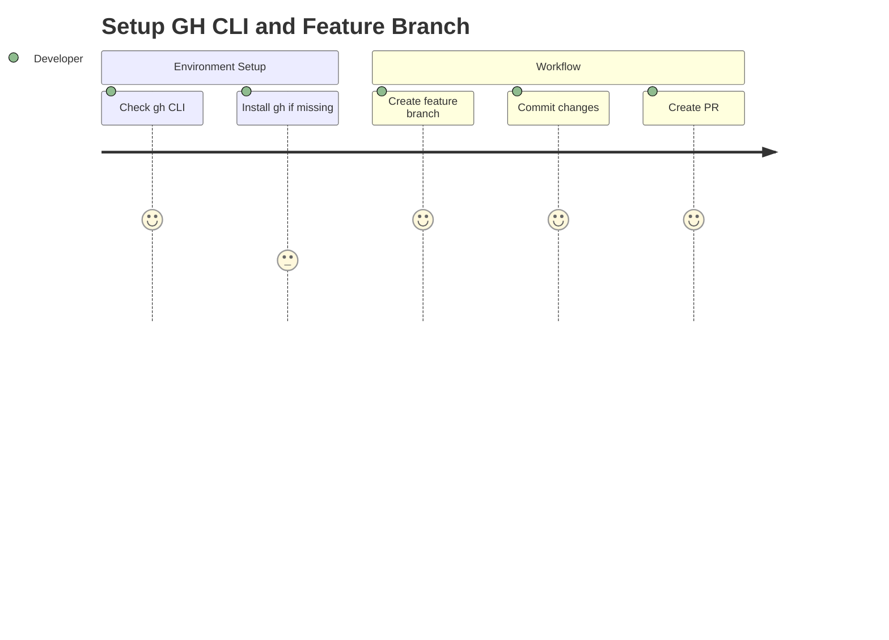
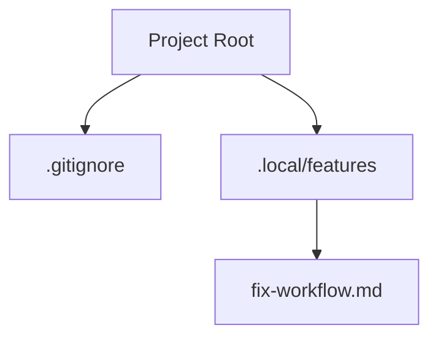

# Feature: Fix GitHub CLI and Branch Workflow

## Description
Ensure `gh` CLI is available and implement the proper feature branch workflow for the project.

## User Story
As a developer (Tom), I want to use the GitHub CLI (`gh`) to manage pull requests and follow the feature branch workflow so that my development process is standardized and secure.

## User Benefits
- Automated GitHub operations.
- Clean git history with feature branches.
- Adherence to project delivery rules.

## Acceptance Criteria
- [ ] Verify or provide instructions for `gh` CLI installation.
- [ ] Create a feature branch for the previous `.gitignore` changes.
- [ ] Create a Pull Request using `gh` if possible, or provide instructions.
- [ ] Set up the environment for Bun correctly.

## Complexity Estimate
Low

## TDD Test Cases
1. `gh --version` should return the version of GitHub CLI.
2. `git branch` should show the current feature branch.

## Diagrams

### User Journey

### Module Structure

