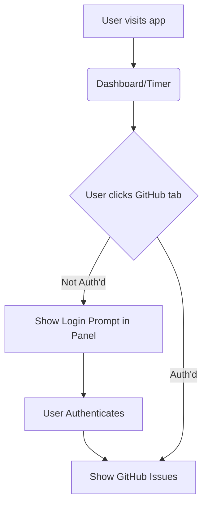
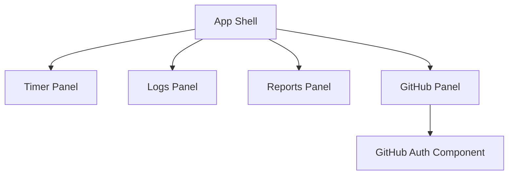

# Feature: GitHub Authentication in GitHub Panel Only

## Brief Description
Move GitHub authentication from a global application blocker to only be required within the GitHub Tracking panel.

## User Story
As a user, I want to be able to use the core features of the application (Timer, Logs, Reports) without needing to authenticate with GitHub. I only want to authenticate with GitHub when I explicitly visit the GitHub Tracking panel to manage my issues.

## User Benefits
- Allows using the offline/local time tracking features without an internet connection or GitHub account.
- Reduces friction for onboarding.
- Adheres to the principle of progressive enhancement/disclosure.

## Acceptance Criteria
- Global auth blocker in `+page.svelte` is removed.
- `TimerPanel`, `LogsPanel`, and `ReportsPanel` are accessible immediately upon loading the application.
- The `GithubIssuesPanel` handles its own authentication state and prompts for login if unauthenticated when the panel is active.
- `authStore` global check is removed from the root layout/page.

## Rough Complexity Estimate
Low

## TDD Test Cases
- Verify that loading the root URL (`/`) immediately shows the Dashboard (Timer panel) without a GitHub login prompt.
- Verify that clicking on Logs or Reports works without authentication.
- Verify that clicking on GitHub Tracking prompts for authentication if no session exists.
- Verify that after authenticating within the GitHub Tracking panel, issues load successfully.

## Mermaid Diagrams

### User Journey

### System Placement

