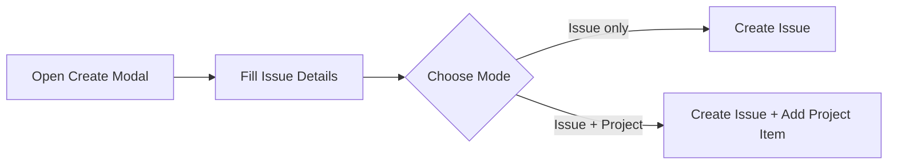
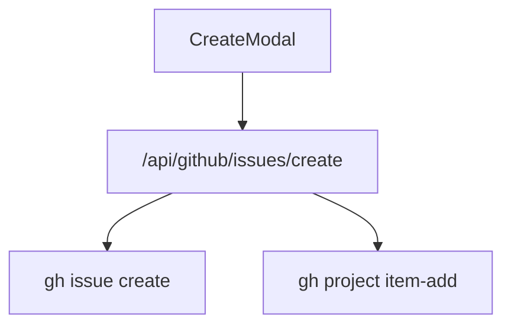
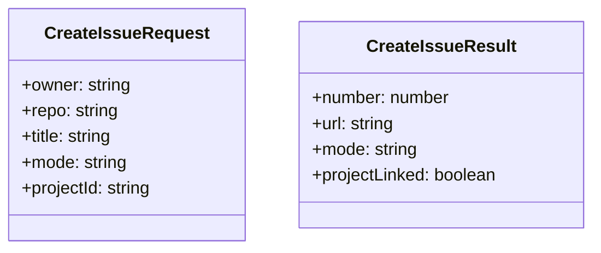

# Feature: Create GitHub Issue From WorkTrack

## Brief Description
Create GitHub issues from WorkTrack with a per-action mode selector: Issue only or Issue + Project.

## User Story
As a planner, I want to add a new task to GitHub from WorkTrack so backlog management stays in sync with execution.

## User Benefits
- Faster backlog capture where work is tracked
- Flexible creation mode per action
- Reduced friction between planning and execution tools

## Acceptance Criteria
- [ ] Create form captures owner, repo, title, and optional body
- [ ] User can select mode: issue-only or issue-and-project
- [ ] Success result includes created issue URL and number
- [ ] Partial success state shown if issue created but project add fails

## Rough Complexity Estimate
High

## TDD Test Cases
### Unit Tests
- Validate request payload and mode branching
- Map API success/partial-failure responses

### Component Tests
- Render mode selector and project input conditionally
- Submit button disabled until required fields are complete

### E2E Tests
- Create issue-only and verify success message
- Create issue-and-project and verify result or partial success message

## Mermaid: User Journey

## Mermaid: System Placement

## Mermaid: Module Structure

