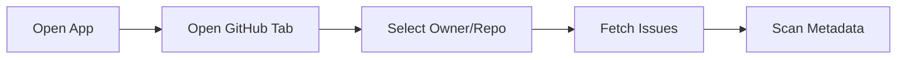
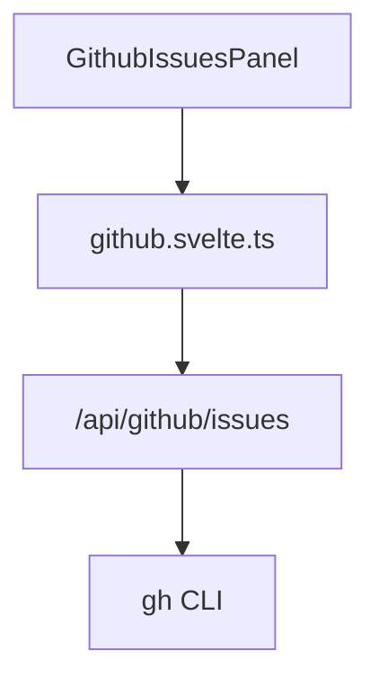
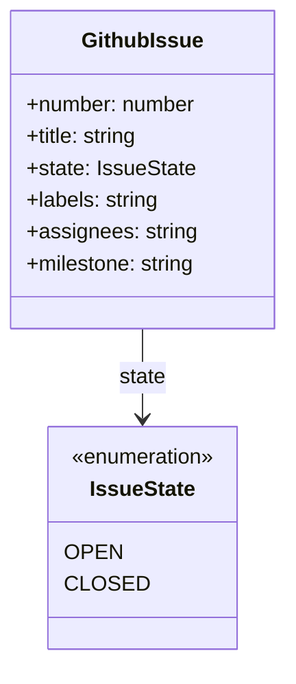

# Feature: GitHub Issues Metadata Listing

## Brief Description
List repository issues inside WorkTrack with rich metadata to reduce context switching while planning and tracking work.

## User Story
As a team member, I want to see GitHub issues and their metadata in WorkTrack so I can pick the right work item quickly.

## User Benefits
- Faster issue triage without leaving WorkTrack
- Better visibility into assignees, labels, and status
- Fewer mistakes from stale or incomplete issue context

## Acceptance Criteria
- [ ] User can fetch issues for a selected owner and repository
- [ ] UI displays number, title, state, labels, assignees, milestone, timestamps, and URL
- [ ] UI supports loading, empty, error, and retry states

## Rough Complexity Estimate
Medium

## TDD Test Cases
### Unit Tests
- Normalize raw issue JSON into typed records
- Preserve nullable metadata fields safely

### Component Tests
- Render metadata badges and link
- Render retry action when fetch fails

### E2E Tests
- Load issues for a repository and verify metadata is visible
- Simulate failed fetch and verify retry recovery

## Mermaid: User Journey

## Mermaid: System Placement

## Mermaid: Module Structure

