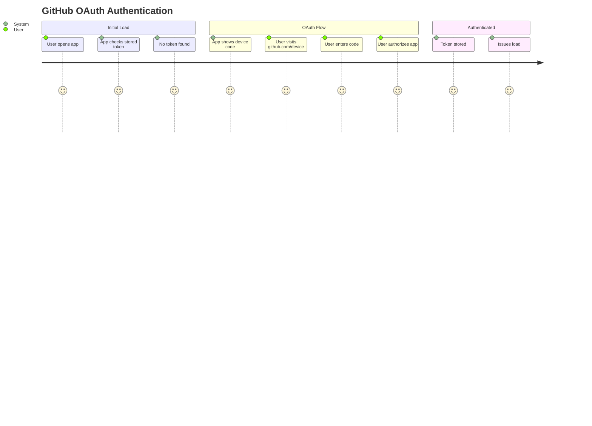
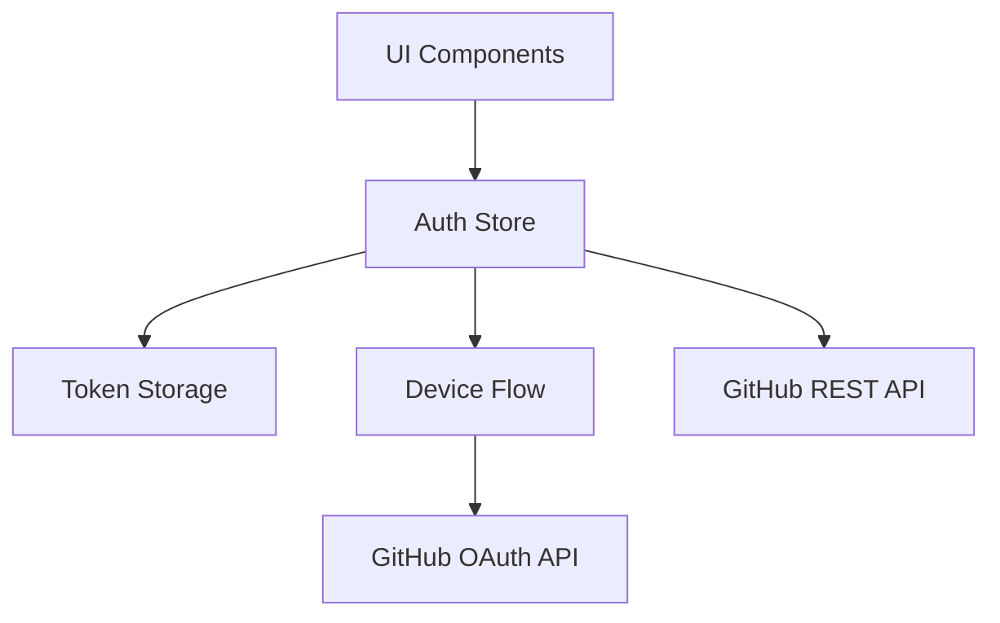
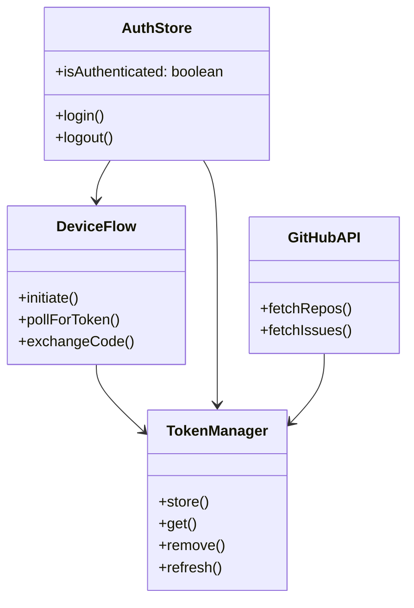

# Feature: GitHub OAuth Authentication

## Description

Pure OAuth 2.0 device flow authentication for GitHub integration. No CLI dependencies, no manual token management—just browser-based login with secure token handling.

## User Story

As a user, I want to authenticate with GitHub via OAuth device flow so I can securely access my repositories and issues without managing tokens or installing CLI tools.

## User Benefits

- **Zero CLI dependencies** - Works entirely in the browser
- **Secure by default** - OAuth tokens with automatic refresh
- **Simple UX** - Enter device code, authorize on GitHub, done
- **Cross-platform** - Any device with a browser

## Acceptance Criteria

- [ ] OAuth 2.0 device flow fully implemented
- [ ] Secure token storage (sessionStorage)
- [ ] Token refresh when expired
- [ ] All GitHub API calls use OAuth tokens
- [ ] Manual PAT fallback for edge cases
- [ ] Clear OAuth setup documentation

## Rough Complexity Estimate

Medium

## TDD Test Cases

### OAuth Flow Tests

1. **Device Code Request** - Device code generated correctly
2. **Token Exchange** - Access token received and stored
3. **Token Refresh** - Expired tokens refreshed automatically
4. **Logout** - Tokens cleared completely

### API Integration Tests

5. **Token Injection** - OAuth token in all API requests
6. **Auth Error Handling** - 401 triggers re-authentication
7. **API Calls** - Repos, issues, user data fetch correctly

### Fallback Tests

8. **PAT Input** - Manual token entry works as backup

## Test Rules

### Unit Test Rules

| Rule | Description | Priority |
|------|-------------|----------|
| R1 | Device flow must generate unique device codes for each session | High |
| R2 | Token storage must encrypt tokens before saving to sessionStorage | High |
| R3 | Token refresh must happen automatically before expiry (5 min buffer) | High |
| R4 | All API requests must include Authorization header with Bearer token | High |
| R5 | 401/403 responses must trigger auth state reset and re-login prompt | High |
| R6 | Network errors during polling must retry with exponential backoff (max 5) | Medium |
| R7 | Device code expiration (15 min) must show clear error to user | Medium |
| R8 | Token revocation on GitHub side must be detected and handled | Medium |

### E2E Test Rules

| Rule | Scenario | Expected Result |
|------|----------|---------------|
| E1 | Fresh user opens GitHub panel | Login prompt shown immediately |
| E2 | User clicks Login → copies code → visits github.com/device | Device code entry succeeds |
| E3 | User authorizes app on GitHub | Token received, issues load automatically |
| E4 | User refreshes page after login | Auth state persists, no re-login needed |
| E5 | Token expires while browsing issues | Silent refresh, user sees no interruption |
| E6 | User revokes app on GitHub settings | Next API call shows re-auth prompt |
| E7 | User clicks Logout | Token cleared, login prompt shown |
| E8 | OAuth server returns error | User-friendly error message displayed |

### Security Test Rules

| Rule | Requirement |
|------|-------------|
| S1 | Tokens must never be logged to console or sent to error trackers |
| S2 | sessionStorage must be cleared on browser close (not persistent) |
| S3 | XSS must not be able to steal tokens from storage |
| S4 | Man-in-the-middle must not intercept device code exchange |
| S5 | Token refresh must use rotating refresh tokens if available |

### Edge Case Rules

| Case | Handling |
|------|----------|
| Network loss during auth | Show retry button, preserve pending state |
| User cancels GitHub auth | Return to login screen with "canceled" message |
| Rate limited by GitHub | Show "too many attempts, try again in X minutes" |
| Invalid CLIENT_ID | Clear error: "OAuth not configured properly" |
| Scope insufficient | Detect 403 on API calls, prompt for re-auth with more scopes |

## Mermaid Diagrams

### User Journey



### System Architecture



### Module Structure



## Implementation

### Core Components

1. **Device Flow** - `src/lib/github/device-flow.ts`
2. **Token Manager** - Secure storage with refresh
3. **Auth Store** - Svelte 5 reactive auth state
4. **API Client** - OAuth token injection

### UI Components

1. **DeviceAuthModal** - Shows device code and instructions
2. **Auth Status** - Shows login/logout state
3. **Error Handling** - OAuth failure messages

### Files

```
src/lib/github/
  ├── device-flow.ts       # Device flow implementation
  ├── oauth-client.ts      # OAuth API client
  ├── token-manager.ts     # Token storage & refresh
  └── api.ts               # GitHub API with auth

src/lib/stores/
  └── auth.svelte.ts       # Auth state store

src/lib/components/
  └── DeviceAuthModal.svelte
```

### Environment

```
VITE_GITHUB_DEVICE_CLIENT_ID=<oauth-app-client-id>
VITE_GITHUB_OAUTH_SCOPES=repo,read:org
```
