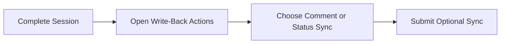
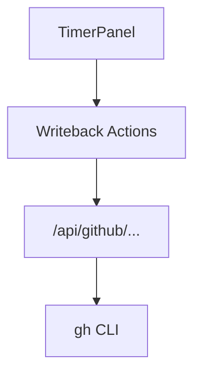
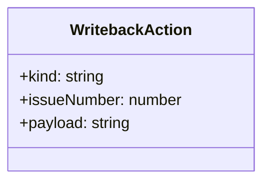

# Feature: Optional GitHub Write-Back Actions

## Brief Description
Provide explicit, optional actions to push updates from WorkTrack to GitHub (comments/status) without changing default read-first behavior.

## User Story
As a team member, I want optional write-back controls so I can sync progress to GitHub when it makes sense.

## User Benefits
- Controlled synchronization without surprise mutations
- Better audit trail from timed work to issue history
- Safer defaults with explicit write intent

## Acceptance Criteria
- [ ] Write-back actions are opt-in and user-triggered
- [ ] Supported actions include post time-log comment and optional state update
- [ ] Errors show actionable feedback and do not disrupt timers

## Rough Complexity Estimate
High

## TDD Test Cases
### Unit Tests
- Build comment payload from session data
- Validate state transition mapping rules

### Component Tests
- Render action toggles and call APIs only on explicit click
- Show non-blocking error messages for failed write-backs

### E2E Tests
- Trigger comment write-back after completed timer session
- Verify failures do not remove local tracked session data

## Mermaid: User Journey

## Mermaid: System Placement

## Mermaid: Module Structure

