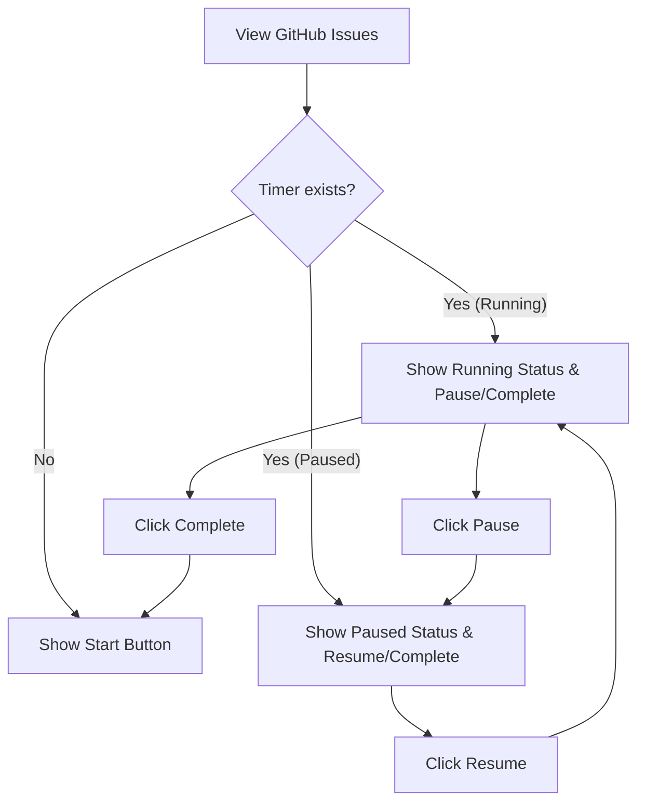
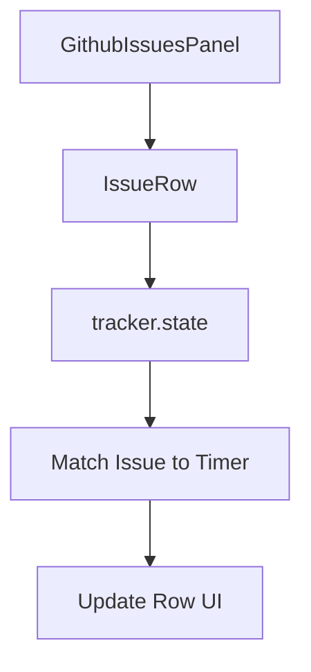
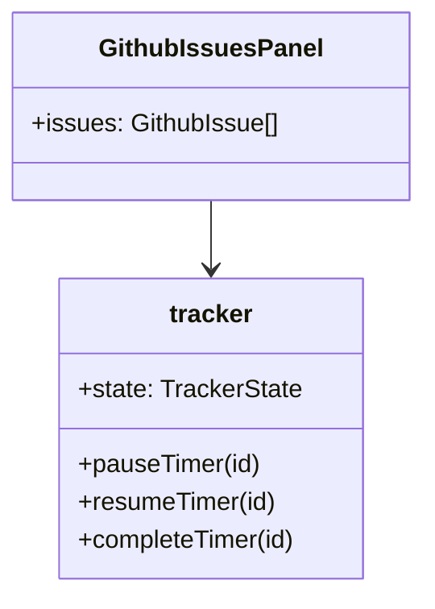

# Feature: GitHub Panel Timer Status

## Brief Description
Display active tracking status and elapsed time for issues in the GitHub Tracking panel.

## User Story
As a developer, I want to see which issues I am currently tracking or have paused while browsing the GitHub panel, so I can easily manage my active tasks without switching tabs.

## User Benefits
- Visual feedback on active tracking within the GitHub context.
- Immediate awareness of which tasks have been started/paused.
- Quick access to resume/pause/stop actions for issue-linked timers.

## Acceptance Criteria
- [ ] Each issue row in the GitHub Tracking panel displays its timer status if a matching timer exists.
- [ ] If a timer is "In Progress", show a "Running" indicator and the current elapsed time.
- [ ] If a timer is "On Hold", show a "Paused" indicator and the accumulated time.
- [ ] Provide "Pause", "Resume", and "Complete" actions directly on the issue row when applicable.
- [ ] The "Start" button is replaced or supplemented by these actions when a timer exists for the issue.

## Rough Complexity Estimate
Medium

## TDD Test Cases
### Unit Tests
- Helper to match GitHub issue to tracker items by title (e.g. "#123 Title").
- Formatting duration for display in the panel.

### Component Tests
- Issue row displays "Running" badge and time when timer is active.
- Issue row displays "Paused" badge when timer is on hold.
- Buttons (Pause/Resume/Complete) call appropriate tracker methods.

### E2E Tests
- Start timer from issue row, verify UI changes to "Running" with timer ticking.
- Pause timer, verify UI changes to "Paused".
- Resume timer, verify UI changes back to "Running".
- Complete timer, verify UI returns to "Start" state (or shows completed).

## Mermaid: User Journey

## Mermaid: System Placement

## Mermaid: Module Structure

