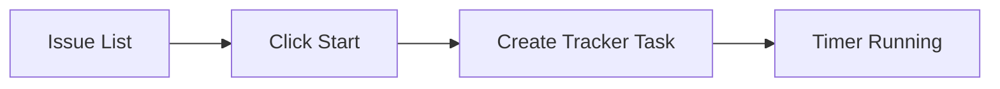
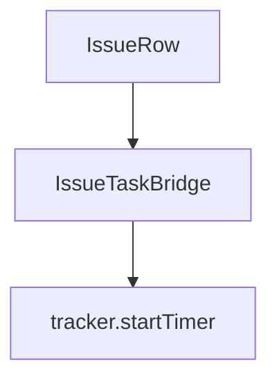
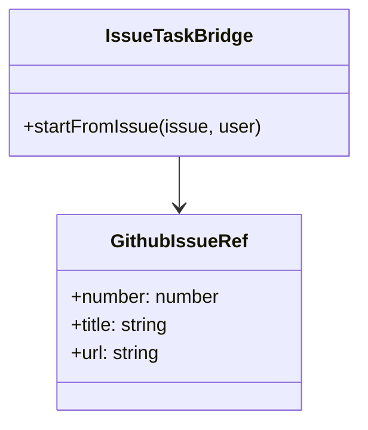

# Feature: Start Timer From GitHub Issue

## Brief Description
Allow starting a WorkTrack timer directly from a GitHub issue row using the existing timer engine.

## User Story
As a developer, I want to click Start on an issue so my tracked time is immediately linked to the work item.

## User Benefits
- One-click task start from backlog context
- Consistent timer behavior with existing manual flow
- Better traceability from tracked time to issue source

## Acceptance Criteria
- [ ] Every issue row has a Start action
- [ ] Clicking Start creates/starts a timer task with issue number and title
- [ ] Behavior follows existing user assignment and active-timer rules

## Rough Complexity Estimate
Medium

## TDD Test Cases
### Unit Tests
- Map issue fields into tracker start payload
- Keep assignment fallback to current user

### Component Tests
- Start button calls bridge function with issue payload
- Disabled state shown while start action is in-flight

### E2E Tests
- Start timer from issue and verify Timer tab shows issue-based task title
- Verify second start for same user follows existing pause/queue behavior

## Mermaid: User Journey

## Mermaid: System Placement

## Mermaid: Module Structure

