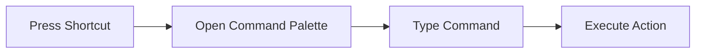
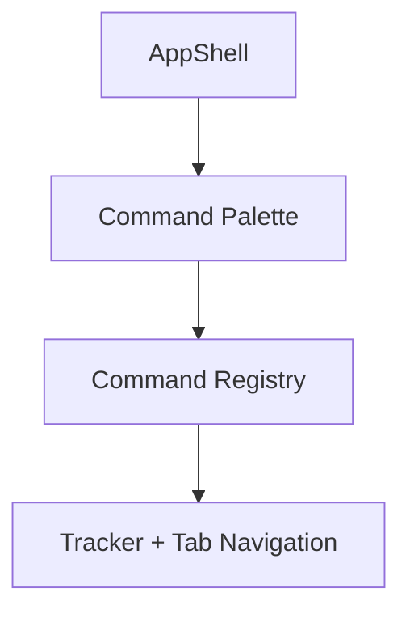
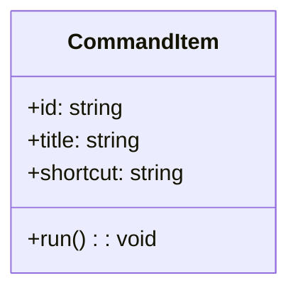

# Feature: Keyboard Shortcuts and Command Palette

## Brief Description
Add keyboard-first controls and a command palette for fast navigation and frequent actions.

## User Story
As a power user, I want keyboard shortcuts and a command palette so I can manage tasks without repetitive mouse actions.

## User Benefits
- Faster daily interaction loops
- Improved accessibility and reduced motion overhead
- Better discoverability of high-value actions

## Acceptance Criteria
- [ ] Global shortcut opens command palette
- [ ] Palette includes actions: switch tab, start timer, add pending task, open GitHub tab
- [ ] Shortcut hints are discoverable in UI help area

## Rough Complexity Estimate
Medium

## TDD Test Cases
### Unit Tests
- Command registry validates id uniqueness
- Shortcut parser resolves key combos consistently

### Component Tests
- Palette opens/closes via keyboard
- Selecting command invokes expected action callback

### E2E Tests
- Trigger palette shortcut and execute a command
- Verify focus management and escape-to-close behavior

## Mermaid: User Journey

## Mermaid: System Placement

## Mermaid: Module Structure

