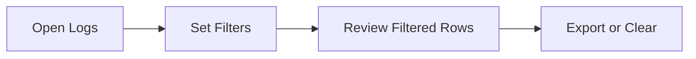
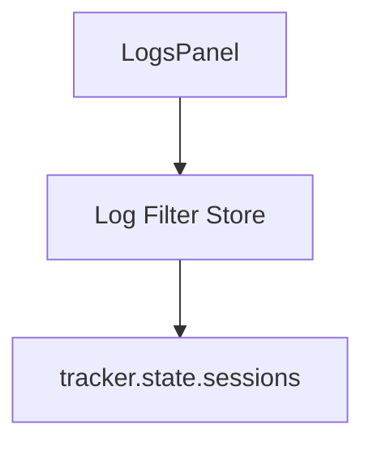
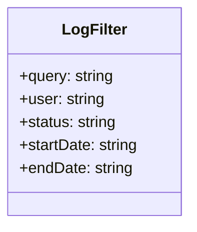

# Feature: Logs Advanced Filters and Search

## Brief Description
Add advanced filters and text search in Work Logs for user, client, project, status, and date range.

## User Story
As a manager, I want to filter logs precisely so I can review work history quickly.

## User Benefits
- Faster auditing of historical work
- Easier debugging of missing or incorrect sessions
- Better reporting preparation from filtered data

## Acceptance Criteria
- [ ] Search field filters by task/client/project text
- [ ] Filters exist for user, status, and date range
- [ ] Active filters are visible and can be cleared in one action

## Rough Complexity Estimate
Medium

## TDD Test Cases
### Unit Tests
- Filter pipeline applies criteria in deterministic order
- Date range filter handles inclusive boundaries

### Component Tests
- Filter controls update visible rows
- Clear-all resets both controls and list state

### E2E Tests
- Apply multiple filters and verify resulting rows
- Refresh page and verify expected persistence behavior

## Mermaid: User Journey

## Mermaid: System Placement

## Mermaid: Module Structure

