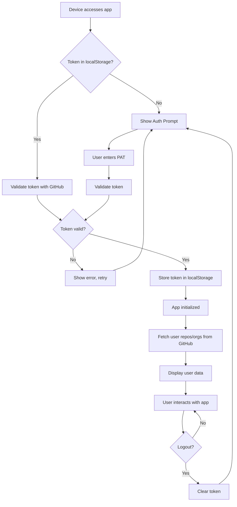
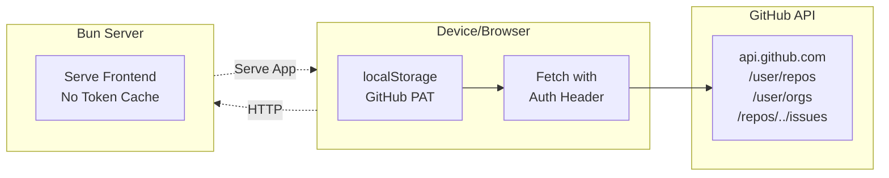
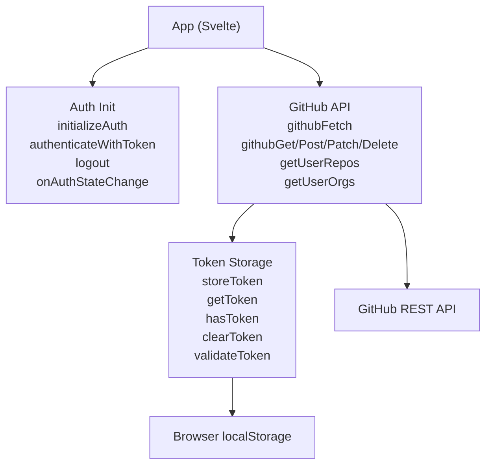

# Feature: Multi-Tenant GitHub Authentication

## Brief Description

Refactor the application from single-user hardcoded authentication to multi-tenant, per-device authentication. Each browser accessing the app independently authenticates with GitHub using a Personal Access Token (PAT) and views only their own repositories and organizations. Token is stored in browser localStorage; server maintains zero token state.

## User Story

**As a** local network user accessing the shared app on my device  
**I want to** authenticate with my own GitHub credentials  
**So that** I see only my GitHub repositories and organizations, isolated from other users on the network

## User Benefits

1. **Privacy**: Each device's GitHub data is completely isolated
2. **Multi-User Support**: Multiple family/team members can use the app simultaneously from different devices with different GitHub accounts
3. **No Server Token Management**: Eliminates server-side credential storage security risks
4. **Session Persistence**: Token stored in browser, survives page refreshes
5. **Per-Device Scope**: Token scope is device-specific via browser localStorage

## Acceptance Criteria

### Authentication Flow
- [ ] User can input GitHub PAT on app load if not authenticated
- [ ] Token is validated against GitHub API before accepting
- [ ] Valid token is stored in browser localStorage
- [ ] App initializes by checking for existing token on page load
- [ ] If token exists and is valid, skip login prompt; if invalid/expired, show login prompt

### Data Fetching
- [ ] All GitHub API requests automatically include user's token in `Authorization: Bearer <token>` header
- [ ] `/user/repos` endpoint called directly from browser, returns authenticated user's repos
- [ ] `/user/orgs` endpoint called directly from browser, returns authenticated user's orgs
- [ ] `/repos/{owner}/{repo}/issues` returns only repos accessible to authenticated user

### Error Handling
- [ ] 401 Unauthorized errors trigger re-authentication prompt
- [ ] 404 errors handled gracefully
- [ ] Network errors show user-friendly messages
- [ ] Invalid token rejected with clear error message

### Session Management
- [ ] User can log out, clearing token from localStorage
- [ ] Token expiry (optional): support optional token expiration in hours
- [ ] Multiple browser tabs/windows on same device share same token state

### Server Independence
- [ ] Server does not cache or store any user tokens
- [ ] Server does not have hardcoded GitHub credentials
- [ ] Server only serves frontend; all GitHub API calls are client-side

## Complexity Estimate

**Medium**

- Token storage: Low (localStorage)
- API wrapper with auth headers: Medium (error handling, multiple HTTP methods)
- Auth initialization & state: Medium (validation, subscription model)
- Testing: Medium (mocking GitHub API, localStorage)
- Integration with existing UI: TBD (depends on component refactoring)

## TDD Test Cases

### Token Storage (`src/lib/auth/tokenStorage.ts`)
- [ ] `storeToken()` saves token to localStorage
- [ ] `storeToken()` throws error on empty token
- [ ] `getToken()` returns stored token
- [ ] `getToken()` returns null if not stored
- [ ] `getToken()` returns null if token expired
- [ ] `hasToken()` returns true when valid token exists
- [ ] `hasToken()` returns false when token missing
- [ ] `hasToken()` returns false when token expired
- [ ] `clearToken()` removes token from localStorage
- [ ] `validateToken()` calls GitHub /user endpoint
- [ ] `validateToken()` returns true for valid token
- [ ] `validateToken()` returns false for invalid token

### GitHub API Client (`src/lib/github/api.ts`)
- [ ] `githubFetch()` throws error if no token stored
- [ ] `githubFetch()` includes `Authorization: Bearer <token>` header
- [ ] `githubFetch()` throws `GitHubAuthError` on 401 response
- [ ] `githubFetch()` throws `GitHubNotFoundError` on 404 response
- [ ] `githubGet()` makes GET request with token
- [ ] `githubPost()` makes POST request with JSON body and token
- [ ] `githubPatch()` makes PATCH request with JSON body and token
- [ ] `githubPut()` makes PUT request with JSON body and token
- [ ] `githubDelete()` makes DELETE request with token
- [ ] `getUserRepos()` calls `/user/repos` endpoint
- [ ] `getUserOrgs()` calls `/user/orgs` endpoint
- [ ] `getUserProfile()` calls `/user` endpoint
- [ ] `getRepoIssues()` calls `/repos/{owner}/{repo}/issues` endpoint

### Auth Initialization (`src/lib/auth/init.ts`)
- [ ] `initializeAuth()` checks for existing token
- [ ] `initializeAuth()` validates token with GitHub API
- [ ] `initializeAuth()` sets `isAuthenticated: true` if token valid
- [ ] `initializeAuth()` sets `isAuthenticated: false` if token missing/invalid
- [ ] `initializeAuth()` clears expired token
- [ ] `authenticateWithToken()` validates token before storing
- [ ] `authenticateWithToken()` stores valid token
- [ ] `authenticateWithToken()` rejects invalid token with error
- [ ] `logout()` clears token and sets `isAuthenticated: false`
- [ ] `onAuthStateChange()` calls callback when state changes
- [ ] `onAuthStateChange()` returns unsubscribe function
- [ ] `getAuthState()` returns current auth state

## Mermaid Diagrams

### User Journey

### System Placement

### Module Structure

## Implementation Notes

- Token is stored **unencrypted** in localStorage (browser's responsibility, same as other web apps)
- Tokens should be **scoped** to minimal required GitHub permissions
- **HTTPS only** recommended for production
- All three modules are **framework-agnostic** vanilla TypeScript
- Existing server routes (e.g., `/api/github/issues`) will need refactoring to accept client token or be removed entirely

## Definition of Done

- [ ] Feature proposal document (this file) reviewed
- [ ] All TDD test cases pass (before implementation)
- [ ] All three modules implemented and tested
- [ ] Feature branch merged to main
- [ ] No breaking changes to existing functionality
- [ ] Documentation updated in `.local/MULTITENANT_AUTH_GUIDE.md`
