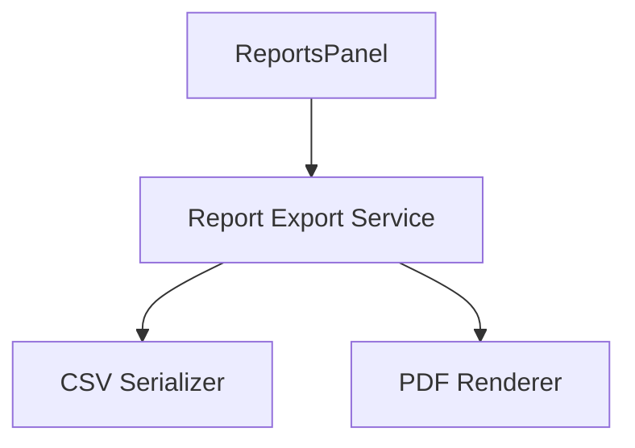
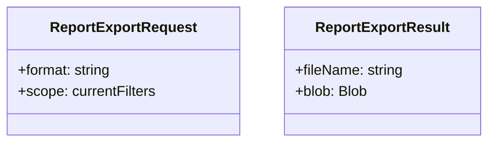

# Feature: Reports Export CSV and PDF

## Brief Description
Enable exporting summary and detailed report data to CSV and PDF directly from the Reports panel.

## User Story
As a team lead, I want export options so I can share reports with stakeholders and billing systems.

## User Benefits
- Easier stakeholder communication
- Quicker handoff to finance and external clients
- Reproducible report snapshots for audits

## Acceptance Criteria
- [ ] CSV export includes user/client/project/task hierarchy with durations
- [ ] PDF export includes summary totals and generation timestamp
- [ ] Exports respect currently selected report filters

## Rough Complexity Estimate
Medium

## TDD Test Cases
### Unit Tests
- CSV serialization preserves hierarchy and totals
- Duration formatting is stable across exports

### Component Tests
- Export buttons disabled when no data
- Export actions trigger correct serializer per format

### E2E Tests
- Export CSV and validate downloaded file content
- Export PDF and validate non-empty file download

## Mermaid: User Journey

## Mermaid: System Placement

## Mermaid: Module Structure

