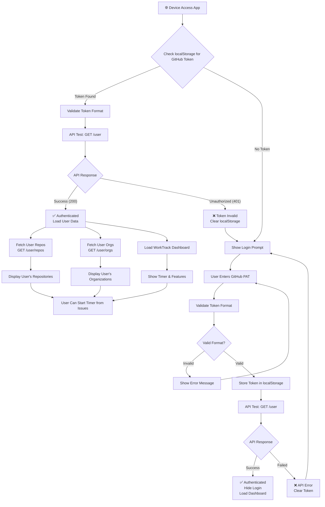
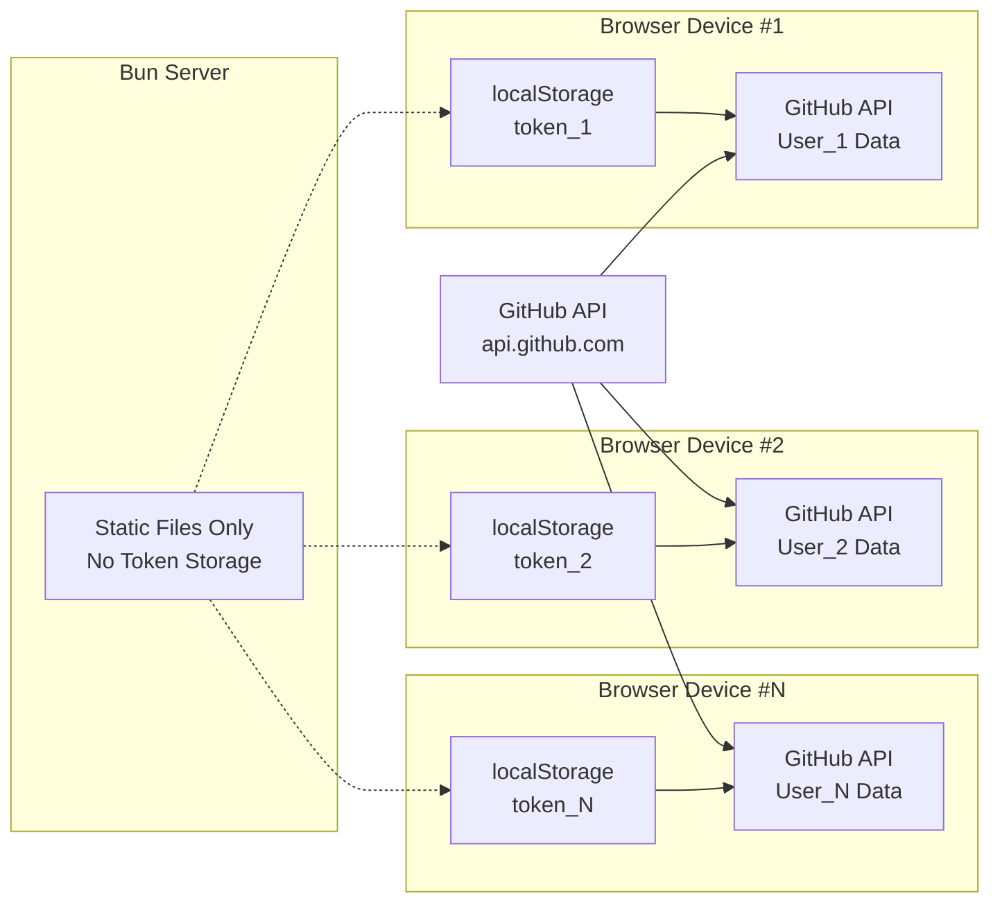
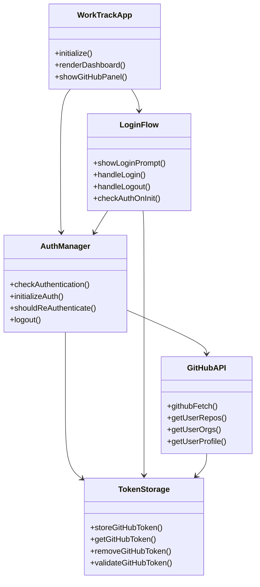
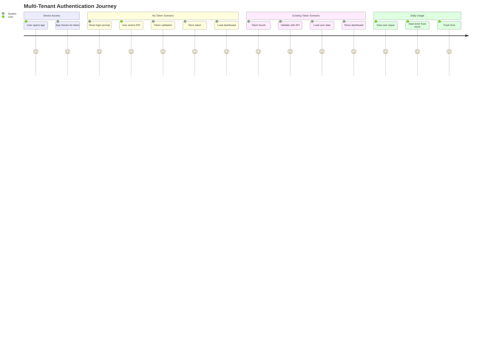

# Multi-Tenant Authentication Architecture Flow

## System Overview

This diagram illustrates the multi-tenant authentication system where each device/browser independently authenticates with GitHub and accesses its own repositories and organizations.

## Authentication Flow Diagram



## Data Flow Architecture



## Component Interaction Diagram



## Security & Isolation

```mermaid
graph TB
    subgraph "Device A Browser"
        LA[localStorage_A]
        TA[Token_A]
        SA[Session_A]
    end
    
    subgraph "Device B Browser"
        LB[localStorage_B]
        TB[Token_B]
        SB[Session_B]
    end
    
    subgraph "GitHub API"
        GA[User_A Data]
        GB[User_B Data]
    end
    
    subgraph "Bun Server"
        BS[Static Files<br/>No User Data]
    end
    
    TA --> GA
    TB --> GB
    
    LA -.-> TA
    LB -.-> TB
    
    BS --> LA
    BS --> LB
    
    LA -.x. LB
    TA -.x. TB
    SA -.x. SB
```

## User Journey Flow



## Key Architecture Principles

1. **Client-Side Storage**: Each device stores its own token in localStorage
2. **Server Independence**: Bun server only serves static files, no authentication logic
3. **Direct API Access**: Browser communicates directly with GitHub API
4. **Token Isolation**: Tokens are completely isolated per device/browser
5. **Automatic Validation**: Tokens are validated on each app load
6. **Graceful Degradation**: Invalid tokens are automatically cleared and re-authentication is prompted
